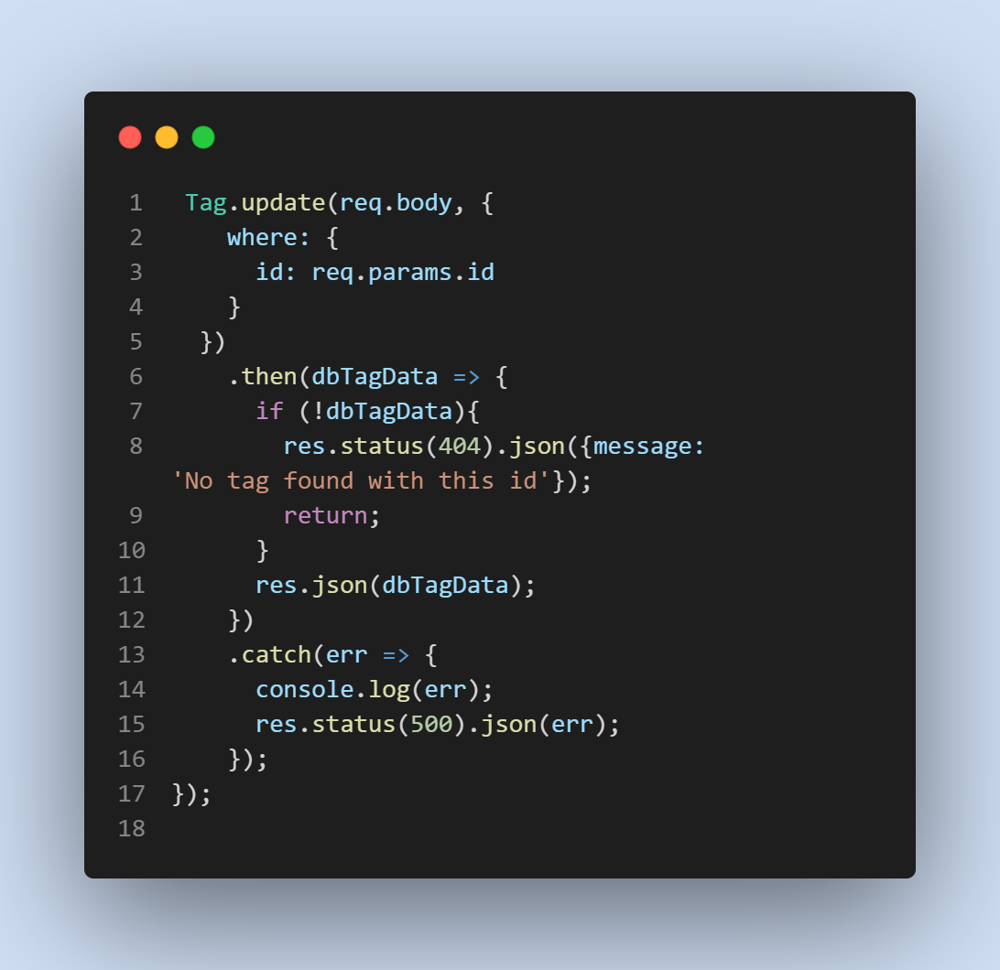
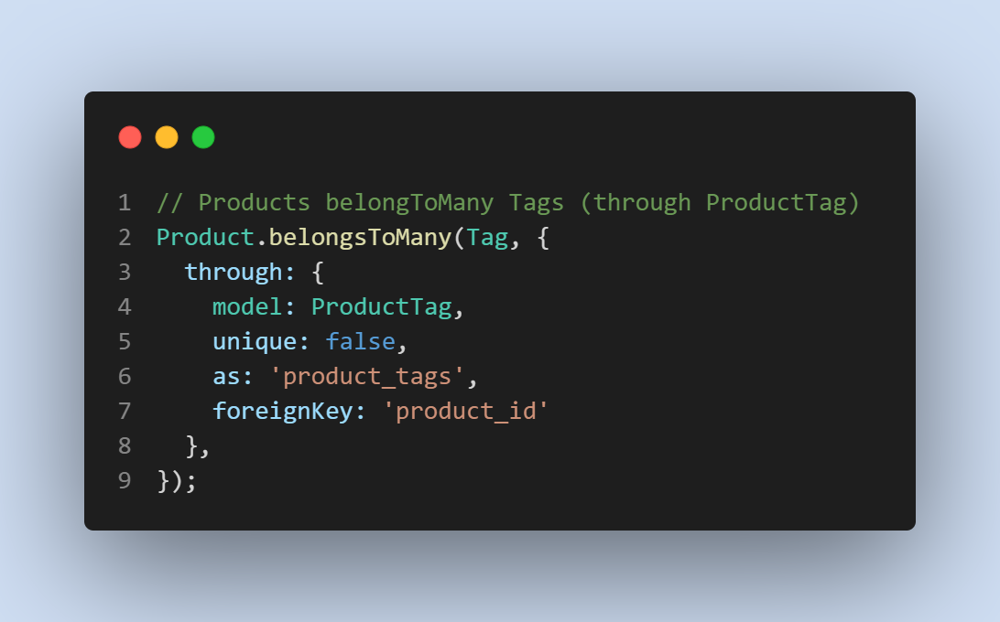

# E-commerce

* [Categories Video](https://drive.google.com/file/d/1xgVP1H99c46tJDN_ODjmHD1o5j5UrXXG/view)

* [Tags Video](https://drive.google.com/file/d/1__EUrn98ghH707ZydTbAMia2NayCAozq/view)

* [Products Video](https://drive.google.com/file/d/1avgj64gfUkiQolPXA-22XjE06nc9ijnb/view)

### Insomnia:
.png)

## Description

 * Learned what an ORM is and how ORMs like Sequelize help manage tricky SQL queries and modeled data in JavaScript.
* Utilized Sequelize to create associations and connect multiple types of Data. 
* This activity helped to understand the fundamental back-end database structure of popular e-commerce websites.
* Perform RESTful CRUD operations to fill out API routes.

# Table of contents
1. [Technologies used](#techologies-used)
2. [Features](#features)
3. [Screenshots](#screenshots)
4. [Credits](#credits)
5. [License](#license)

## Technologies used
* Javascript
* MySql
* Sequilize ORM
* Express
* Node
* Insomnia

## Features
* Post Routes for Categories, Products, and Tags
* Update routes for Categories, Products, and Tags
* GET routes for Categories, Products, and Tags
* GET By Id Routes for Categories, Products, and Tags
* Delete Routes for Categories, Products, and Tags

## Usage
* Installing necessary dependencies including Dotenv, Express, mysql2, and sequelize
* For developers, run nodemon server.js.
* Run node seeds/index.js when first using to ensure table data is added.
* Screenshots:

## Credits

* [Travis Nichols](https://github.com/travnichols916/E-commerce)

## License
[MIT License](https://choosealicense.com/licenses/mit/)

